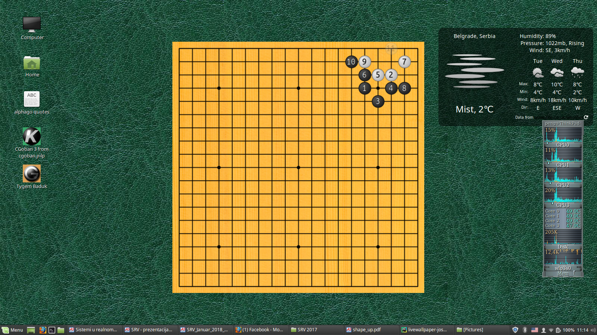

# livewallpaper-joseki-plugin 0.0.2
A plugin for livewallpaper that plays out josekis on the desktop

Features include:
* Chosing corner in which to display joseki (including random)
* Custom joseki dictionary
* Stone placement speed

## Installation

* Install livewallpaper from your distro, or from
  [here](https://launchpad.net/livewallpaper)
* Open up install_plugin.sh and make sure that the path to livewallpaper is correct
* ./install_plugin.sh